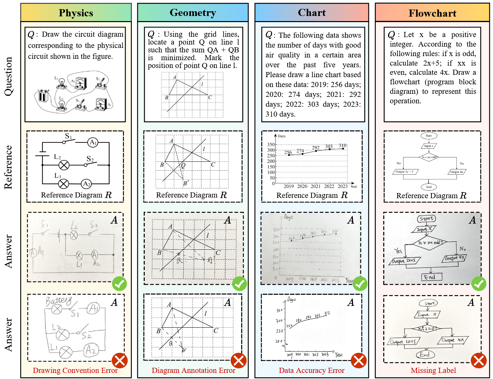
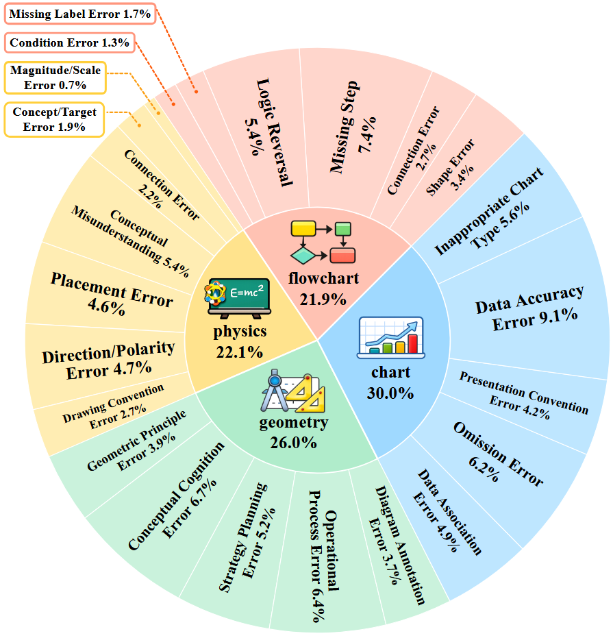

# SketchJudge

**SketchJudge** is a *diagnostic benchmark* for evaluating **multimodal large language models (MLLMs)** as **graders** of *hand-drawn STEM diagrams*.  
Given a problem statement and a student’s freehand diagrammatic answer, SketchJudge evaluates:
1. **Grading correctness** (Is the student's answer correct?)
2. **Fine-grained error diagnosis** (If not, what specific mistakes are present?)

The benchmark covers four STEM diagram domains: **geometry, physics, charts, and flowcharts**.

<p align="center">
  
</p>
<p align="center"><em>Representative instances across four domains: Question (Q), Reference diagram (R), Student answer (A), with corresponding correctness and error labels.</em></p>

---

## 🧭 Benchmark at a glance

- **Domains**: geometry, physics, chart, flowchart  
- **Size**: 300 problems, 1,015 student-drawn answers  
- **Annotations**: binary correctness labels + fine-grained error taxonomy (23 error types)

<p align="center">
  
</p>
<p align="center"><em>Distribution of annotated error types across all domains.</em></p>

---

## 🎯 Evaluation Settings

SketchJudge supports two distinct grading settings:

- **WithRef (Reference-based)**: The model is given the question, student answer, and a clean reference diagram.
- **NoRef (Reference-free)**: The model must grade based only on the question and student answer, testing its robustness under ambiguity and drawing variation.

---

## 📂 Project Layout

```text
SketchJudge/
  run_inference.py          # Run a model grader over a dataset and save per-item predictions (JSONL)
  eval.py                   # Evaluation utilities (accuracy, example-based F1, etc.)
  data_utils.py             # Dataset loading and query construction
  prompts/
    prompt_baseline.yaml
    prompt_cot.yaml
    prompt_rubric.yaml      # Prompt templates used by different grading settings
  models/
    __init__.py             # Imports model wrappers to self-register
    base.py                 # BaseModel + registry helpers
    gpt.py                  # GPT wrapper (OpenAI API)
    qwen.py                 # Qwen-VL wrapper
    qianfan.py              # Qianfan wrapper
assets/
  figure1.png
  figure2.png
```

---

## 📄 Data Format

SketchJudge adopts a **normalized JSON structure**, split into:

- `questions`: problem definitions (including reference diagram and metadata)
- `annotations`: student answers + correctness/error annotations

Each sample can also be flattened into a unified input format for inference.

### 📘 Question Schema (`questions`)

| Field | Description |
|---|---|
| `question_id` | Unique problem ID (e.g., `"FC_001"`) |
| `query_en` / `query_zh` | Question text (English / optional Chinese) |
| `category` | One of `geometry`, `physics`, `chart`, `flowchart` |
| `gt_image_path` | Path to the reference diagram image |
| `requires_input_image` | Whether an extra image input is required |
| `input_image_path` | Path to optional input image (nullable) |
| `source` | Source tag (e.g., `"web"`, `"newly annotated"`) |

### 🧾 Annotation Schema (`annotations`)

| Field | Description |
|---|---|
| `answer_id` | Unique ID for this student answer |
| `question_id` | Link to corresponding question |
| `image_path` | Path to student’s hand-drawn answer image |
| `is_correct` | Boolean label (True if correct) |
| `error_list` | List of error types (empty if correct) |
| `error_count` | Number of error types |
| `answer_correct_type` | Subtype of correctness (e.g., `"exact_correct"`) |
| `is_hand_drawn` | Boolean (typically `true`) |

---

## 🚀 Running Inference

Use `run_inference.py` to run a model over the dataset and save predictions in JSONL format.

SketchJudge supports both **open-source models** (e.g., Qwen, Qianfan) and **closed-source API-based models** (e.g., GPT-4V, Claude, Gemini). The inference behavior and arguments adapt depending on the backend type.

---

### 🔓 Open-Source Model Example

```bash
python -m run_inference \
  --model-type <model_type> \
  --model-path <path_to_local_checkpoint> \
  --dataset-path <path_to_dataset_directory> \
  --output <path_to_output_jsonl> \
  --temperature <float> \
  --top-p <float> \
  --max-new-tokens <int> \
  --repetition-penalty <float>
```

📌 Notes:
- `--model-path` points to the local checkpoint directory.
- The default setting uses the **WithRef** configuration (includes reference diagram).
- Use decoding arguments like `--temperature`, `--top-p` as needed.

---

### 🔒 Closed-Source (API-Based) Model Example

```bash
python run_inference.py \
  --model-type <model_type> \
  --model-name <model_name> \
  --dataset-path <path_to_dataset> \
  --output <path_to_output_jsonl> \
  --temperature <float> \
  --max-new-tokens <int> \
  --api-key <your_api_key> \
  --no-reference
```

📌 Notes:
- `--api-key` is required for calling OpenAI, Claude, Gemini, etc.
- `--no-reference` activates **NoRef** mode (i.e., excludes reference diagram from prompt).
- No model weights are downloaded locally — all inference is remote.

---

### 🧩 Key Arguments

| Argument           | Description |
|--------------------|-------------|
| `--model-type`     | Backend type (`gpt`, `qwen`, `qianfan`, etc.) |
| `--model-name`     | For API models: model name (e.g., `gpt-4-vision-preview`) |
| `--model-path`     | For open-source models: local checkpoint path |
| `--dataset-path`   | Path to the dataset root (includes `master.json`, `taxonomy.json`, and image folders) |
| `--output`         | Path to save prediction results (JSONL format) |
| `--prompt-path`    | Path to the prompt template (YAML format) |
| `--temperature`    | Decoding temperature |
| `--top-p`          | Top-p sampling (nucleus sampling) |
| `--max-new-tokens` | Max tokens to generate for each response |
| `--repetition-penalty` | Repetition penalty during decoding |
| `--api-key`        | API key (only for API-based models) |
| `--no-reference`   | Run in **NoRef** mode (do not provide reference diagram) |

---

## 📤 Prediction Format

Each prediction (line in JSONL) should contain:

```json
{
  "answer_id": "example_answer_id",
  "response": {
    "is_correct": false,
    "error_list": [
      {
        "error_type": "ErrorTypeA",
        "error_description_en": "Description of the first detected error."
      },
      {
        "error_type": "ErrorTypeB",
        "error_description_en": "Description of the second detected error."
      }
    ]
  }
}
```

> ✏️ When `is_correct` is `true`, `error_list` should be empty.

---

## 📊 Evaluation

Evaluation utilities are provided in `eval.py`.

Metrics include:

- ✅ **Binary correctness metrics**: Accuracy, Precision, Recall, F1, MCC
- ✅ **Error-type metrics**: *Example-based F1* (`F1e_example`), computed **only when both gold and predicted labels are incorrect**

Basic usage:

```python
label_index = {rec["answer_id"]: rec for rec in gt_records}
results = load_jsonl("outputs/gpt_preds.jsonl")
evaluate_all(results, label_index)
```

---

## ⚠️ Compatibility Notes

Some models have **conflicting dependencies** (e.g., between `qwen-vl`, `qianfan`).

Recommendations:

- Use **separate virtual environments** or machines for each model group.
- API-based models (GPT-5, Claude, Gemini) run via remote calls and do **not require local installations**.

---

## 📦 Dataset Access

The **SketchJudge dataset** can be downloaded from the following link:  [Dataset Download](https://pan.baidu.com/s/14yVqbQiyG5rNaM9F_nK-SQ), the extraction code is gbmw.

<!-- ---

## 📚 Citation

If you use **SketchJudge** in your work, please cite:

```bibtex
@article{sketchjudge2026,
  title={SketchJudge: A Diagnostic Benchmark for Grading Hand-drawn Diagrams with Multimodal Large Language Models},
  author={...},
  year={2026}
}
``` -->